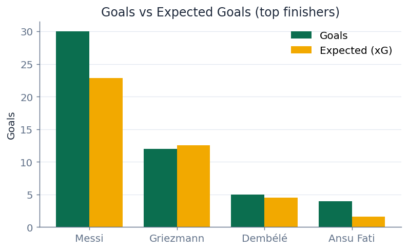
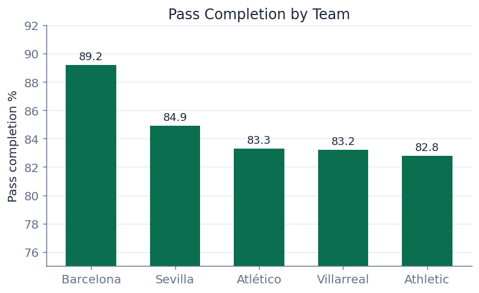
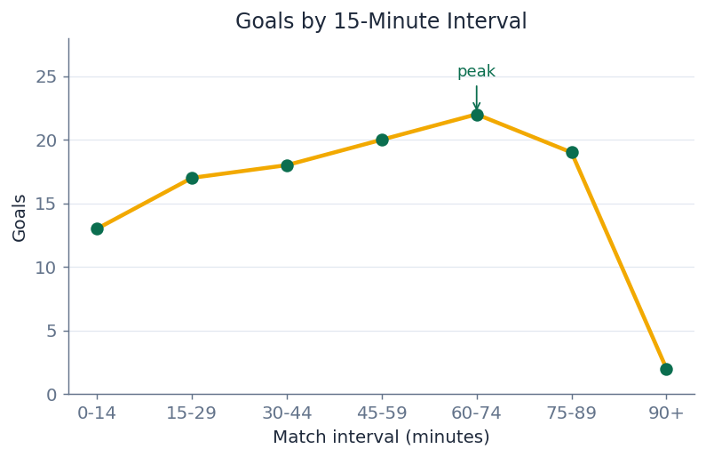

# Results

All figures below come from running the pipeline on the full La Liga 2020/21
open dataset (35 matches, 139,030 events) locally on Java 17.

## Exploratory summary

Most common event types:

| Type | Count |
|------|-------|
| Pass | 40,337 |
| Ball Receipt | 39,197 |
| Carry | 32,900 |
| Pressure | 10,832 |
| Shot | 839 |

Because the open dataset only contains Barcelona's matches, Barcelona accounts
for the large majority of events (≈86,000 of 139,030). Passes, ball receipts,
and carries dominate — roughly 80% of all events are these three on-the-ball
actions, which is why the analysis below focuses on shots and passes.

## Shot efficiency vs xG

Top finishers (minimum 10 shots), with `xg_diff = goals − expected goals`:

| Player | Shots | Goals | xG | Conv % | xG diff |
|--------|------|------|-----|--------|---------|
| Lionel Messi | 195 | 30 | 22.87 | 15.4 | **+7.13** |
| Antoine Griezmann | 64 | 12 | 12.55 | 18.8 | −0.55 |
| Ousmane Dembélé | 47 | 5 | 4.54 | 10.6 | +0.46 |
| Ansu Fati | 14 | 4 | 1.62 | 28.6 | +2.38 |

**Key finding:** Messi scored **7.1 more goals than expected** from his shot
quality — by far the largest over-performance in the dataset, quantifying his
elite finishing. The chart makes the gap visual: every other top shooter sits at
or near their xG line, while Messi's goal bar towers above his expected bar.

At team level Barcelona took 543 shots for 76 goals (14.0% conversion, +3.98
goals vs xG) — and Messi alone accounts for **+7.13 of that +3.98 team figure**,
meaning the rest of the squad collectively *under-performed* their xG. In other
words, Barcelona's finishing edge that season was almost entirely Messi.

## Passing

| Team | Passes | Completion % | Avg length |
|------|--------|--------------|------------|
| Barcelona | 26,317 | 89.2 | 17.7 |
| Sevilla | 1,091 | 84.9 | 20.9 |
| Villarreal | 1,061 | 83.2 | 19.2 |

Barcelona's 89% completion at the **shortest** average pass length (17.7 m vs
~20 m for opponents) reflects a short, possession-based style: lower-risk passes
kept more often. The relationship is consistent across the table — teams with
longer average passes complete fewer of them, exactly what you'd expect since
longer balls are harder to control.

## Event trends across the match

Goals scored, bucketed into 15-minute intervals:

| Interval (min) | Events | Shots | Goals |
|----------------|--------|-------|-------|
| 0–14 | 24,709 | 103 | 13 |
| 15–29 | 21,913 | 129 | 17 |
| 30–44 | 21,678 | 110 | 18 |
| 45–59 | 25,287 | 153 | 20 |
| 60–74 | 19,919 | 145 | **22** |
| 75–89 | 20,461 | 152 | 19 |
| 90+ | 5,063 | 47 | 2 |

Scoring rises steadily through the match and peaks in the **60–75 minute**
window. Notably, shots stay roughly flat across the second half (≈145–153 per
window) while *goals* climb — so the late-game increase is about **finishing
quality**, not shot volume. This is consistent with tiring defences conceding
better chances rather than teams simply shooting more.

## Streaming

The streaming job replays the events as 12 micro-batches and maintains a
running per-team tally. The final batch's totals exactly match the static
aggregation (e.g. Barcelona: 86,274 events, 543 shots, 76 goals), confirming
the streaming logic is consistent with the batch analysis — the same numbers the
transformations stage produces in one pass are reproduced incrementally.

## MLlib — shot-to-goal model

Logistic regression on 839 shots (111 goals), 80/20 split (668 train / 171
test):

| Metric | Value |
|--------|-------|
| AUC (area under ROC) | **0.80** |
| Accuracy | 0.90 |
| F1 | 0.89 |

The ~13% goal base rate means a naive "never a goal" guess would already score
~87% accuracy, so the **AUC of 0.80** is the meaningful number — it shows the
model genuinely discriminates goals from non-goals using xG, shot distance, and
shot context.

This model also ties the analysis together: the same `shot_statsbomb_xg` feature
that revealed Messi's over-performance is the dominant predictor of whether a
shot scores — confirming xG is a meaningful signal, while the residual (what xG
*doesn't* capture) is exactly the finishing skill the shot-efficiency section
measured.
